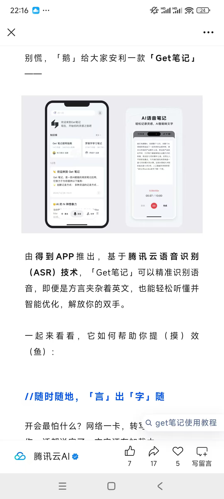
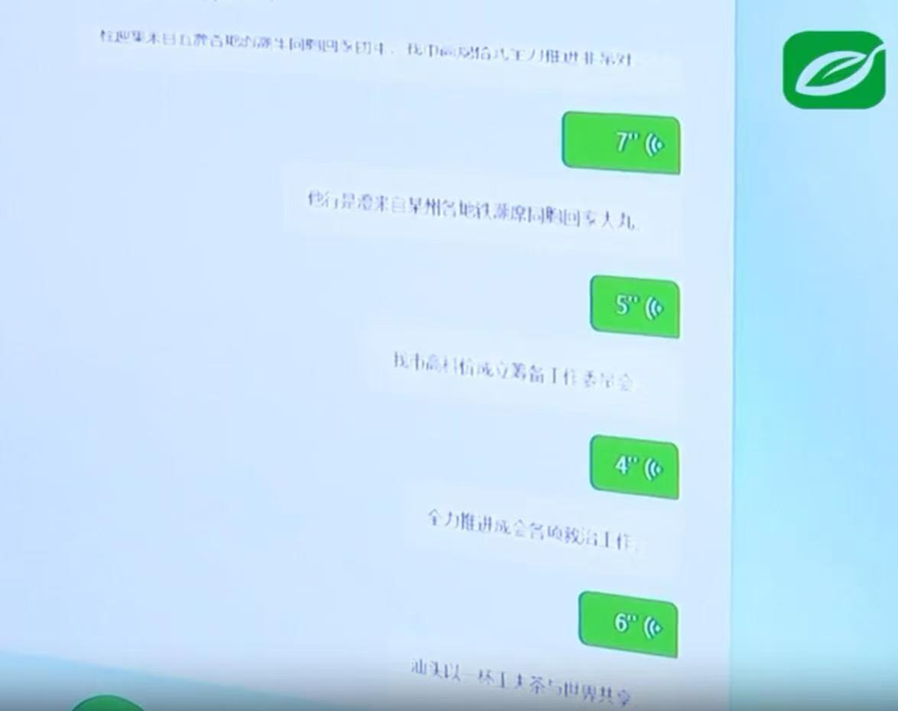
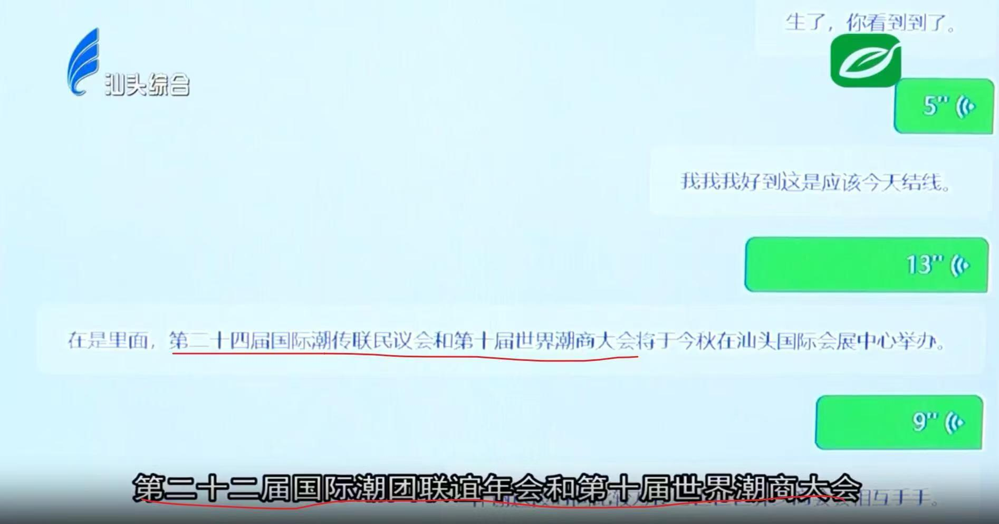

# AI for Teochew

本项目搜集、整理现有的将AI语音技术（主要是语音合成和语音识别）应用到潮州方言的各类工作（论文、商业产品、个人开发、数据集）。

腾讯频道“AI潮汕话”社区，方便不翻墙情况下的交流体验。

频道交流群： 1079414481

PC网页端访问：https://pd.qq.com/s/13fb621f2

手机QQ/微信小程序端：
        

            
        

## 现有工作

### 论文

##### 1、[LREC-COLING 2024] [Experiments on Speech Synthesis for Teochew, Can Taiwanese Help?](https://aclanthology.org/2024.lrec-main.598.pdf) 

很幽默的一篇论文，作者尝试进行潮汕话的语音合成，却懒得做数据集，于是采用了一种方法：从在线潮汕话词典中获取单个字或词的录音文件，与数据量较大的台湾闽南语数据集混合在一起，期望通过`句子级的闽南语数据` + `字词级的潮汕话数据`，让模型学习到`句子级的潮汕话语音合成能力`，例如变调能力。

最终，由于台湾闽南语和潮汕话实际差别过大，作者的设想并没成功实现。

#####  2、[广播电视信息-期刊]基于多模态标注技术的潮汕方言语音识别系统在广电融媒体中的应用研究；作者：陈嘉,陈章华,何侠,胡俊；单位：深圳广播电影电视集团、中山大学
[知网论文地址](https://kns.cnki.net/kcms2/article/abstract?v=VYuoLtjwl8MGLXb2arZXsnTEt5vXRKZV0XesIFkKQRm4kF_DZ4sxYajnYJiU6CFM41rRGxQ2j7Y5dhVfokaRbWZ90UDkWStKtVcjP_ch3gkZgc5eOXnXaLQZbWQlEyNJCt-O-5q_PU55gNijDlG0YNhZ_K-ycI9o&uniplatform=NZKPT)

摘要：针对方言广播电视节目难以智能化管理的问题，本文提出一套融合多模态标注技术的潮汕方言语音识别系统。该系统通过深度挖掘深圳广播电影电视集团融媒体AI实验室资源，创新性地利用汕头融媒集团方言节目（含新闻、情景剧等7类节目），首创三级自动化标注体系构建高质量方言语音数据集；基于Paraformer非自回归端到端模型实现方言精准识别，开发智能媒资管理系统实现方言内容价值挖掘；在新闻播报场景识别准确率达95%，为广电行业方言内容数字化提供完整技术路径，为方言文化保护提供技术支撑。

数据方面，利用汕头电视台的节目（今日实现、美食潮、厝边头尾），构建自动处理管线（OCR识别字幕+声纹匹配+唇部动作，进行时间轴对齐； RNNoise噪声抑制+DEMUCS人声分离，提升音频质量），构建42万条语音数据，留10小时测试集；(根据经验，42万条语音，总时长应该是1000小时左右）

算法方面，利用自监督训练范式，利用大规模无标注潮汕语料进行自监督预热（没说哪个模型），之后，使用精标注语料，对自监督预训练模型的解码端进行微调；解码后，引入滑动窗口语义补全（DistilBERT）和预训练LLM（Qwen系列），对长语义文本回溯重排，解决语义漂移问题。

实验结果（指标为字错率，单位：%，数值越低效果越好）：

###### 表3 针对不同年龄段人群，模型改进的效果展示

| 年龄段   | Paraformer | Paraformer-DistilBERT | Paraformer-LM | Ours  |
|----------|------------|------------------------|---------------|-------|
| 20~30岁  | 14.55      | 13.58                  | 13.66         | 5.01  |
| 30~45岁  | 15.26      | 14.26                  | 14.06         | 6.56  |
| 45~60岁  | 15.37      | 14.05                  | 13.54         | 6.79  |

###### 表4 针对不同节目类型，模型的改进效果展示

| 节目类型     | Paraformer | Paraformer-DistilBERT | Paraformer-LM | Ours  |
|--------------|------------|------------------------|---------------|-------|
| 新闻播报     | 14.05      | 12.02                  | 12.97         | 4.96  |
| 新闻片旁白   | 15.37      | 13.34                  | 12.11         | 5.01  |
| 对话访谈     | 16.58      | 13.05                  | 12.01         | 6.05  |
| 综艺小类节目 | 16.79      | 13.65                  | 12.69         | 6.09  |
| 方言口语采访 | 17.02      | 14.09                  | 13.58         | 7.08  |

### 商业产品

- 1、讯飞输入法-潮汕话识别（实际是翻译）
  
    科大讯飞的讯飞输入法在2022年加入了对潮汕方言的支持，但是其噱头大于使用，实际效果可以说是极差，只能识别很日常、常规的词汇，稍微复杂一点的词，甚至是本地地名（如牌坊街、澄海、潮阳）都识别不了，反倒是对很多闽南语词汇识别的挺准。并且自推出之后从未更新过，多半只是骗补贴的应付项目。

- 2、腾讯API
- 新版微信语音转文字功能，支持潮汕话输入、发送文字。但如若发送的是语音消息，再点击转文字，则不支持识别。
        

            
        

- get 笔记（小程序、app）
    ~~支持27种方言的识别，是目前对潮州话识别支持最好的产品，会识别为谐音字~~。
    
    get笔记母公司本身没太强的AI模型研发能力，其语音转写能力是由腾讯云提供的服务。
        

            
        

  
- 3、五方联手的“家己人”识别器

    ~~目前唯一一个可能可以期待的项目。暂未实际发布~~。
    五方机构分别是：
    -   深圳广电数字科技有限公司（牵头）
    -   汕头融媒集团（即汕头电视台，提供数据和标注）
    -   深圳市智想无界科技有限公司 (封装推广，大概率外包)
    -   北京中科模识科技有限公司（训练模型）
    -   北京语言大学信息科学学院柯登峰团队

    项目时间节点：
    -  2024.05.24 ， 发布第一则推文：[文博会亮点：五方联手潮汕方言语音识别项目 助力地方语言保护与产业发展](https://mp.weixin.qq.com/s/nUjGZrHRQ8ObFSJMNhOo-w)。
    -  2024.09.16 ， 汕头电视台标注团队摆烂，改由汕职院文旅学院 （大专院校）志愿者标注：[潮汕方言实践基地开班！](https://mp.weixin.qq.com/s/M_i__zDDsm8sCWvO1x4bsA)。 
    -  2024.11.24 ，趁世界潮商大会和国际潮团联谊年会在汕头举行，发布半成品炒热度：[潮汕话“语音识别器”来了](https://mp.weixin.qq.com/s/FTfiWC-8IVZQxvt7GhCCMA)。从新闻不甚清晰的特写画面来看，识别效果一般。
    -  2025.02.24 ， 招募金平、龙湖地区的志愿者录制更多数据，[“家己人”的语音识别系统进入优化阶段](https://mp.weixin.qq.com/s/yOwXN5f4fBqZ4osZcaIXeA)

    新闻截图：
        

            
        

        

            
        

    - 2025.09.28 ，宣称已有93.6%的识别准确率，但前提是输入语音内容较为书面，实际口语识别效果折半。 [新闻 | 柯登峰团队获广电AI大赛二等奖，祝贺北语信科](https://mp.weixin.qq.com/s/qYf1QyiDzkuKL-8kmj85hw)

### 非商业产品/作品

- 1、youtube 博主 [Efficient NLP] 用[whisper微调潮州话](https://www.youtube.com/watch?v=JH_78KmP4Zk)，并发布在[huggingface](https://huggingface.co/efficient-nlp/teochew-whisper-medium)。
    
    作者从youtube的潮汕小品视频中，借助字幕切割出35小时左右的数据，对whisper进行微调，效果较差。因为数据集都是自动处理的，非常粗糙，字幕也不能完全反映潮汕话的真实说话内容。

- 2、 微信小程序-潮汕话翻译器
    

        
    

    <!--  -->
    
    评分2.7。客观说，个人感觉效果比讯飞输入法和youtube博主微调的效果好

- 3、 北京语言大学 - 语音合成系统

[新闻｜科技赋能语言和文化——我校信息科学学院教师柯登峰及其研究团队发布创新研究成果](https://mp.weixin.qq.com/s/0WTkTXHCdZJCIcNfL2sdrA)

[数字人视频链接](https://mpvideo.qpic.cn/0bc3neabwaaaciadrosiy5tva2oddnuqagya.f10002.mp4?dis_k=0ff805d3b96a7b7dbe3846304d41e0f4&dis_t=1742575244&play_scene=10120&auth_info=TcDWvN4RVA92yuuzzjFuGjRFSWFkSjtvNkojNhl2Rw5rbkAeLF8rdQduFBJ3CWI5&auth_key=5f5fc3282cf8cf43598ef41bd27787d1&vid=wxv_3744484224561381377&format_id=10002&support_redirect=0&mmversion=false) 

- 4、 暨南大学汉语方言研究中心 - 潮州话语音合成
  
[让机器学会方言——暨南大学—科大讯飞方言语音科技联合实验室通过开题论证](https://dialects.jnu.edu.cn/2024/0318/c16917a808739/page.htm)

[方言语音科技联合实验室揭牌仪式在暨南大学举行](https://dialects.jnu.edu.cn/2024/1217/c16917a827795/page.htm)

[暨南大学方言合成公开课](https://app7iixgnpj3504.h5.xiaoeknow.com/p/course/ecourse/course_34RqxxLAHT12KD5bSm1NR7C5b5v?https%3A%2F%2Fmhrza.xetslk.com%2Fsl%2F1x9LgU=)。 很适合作为语音合成初学者的入门课。

## 本人的工作

### 数据集

- 首个开源的、野外的、正字标注的潮汕话数据集[teochew_wild](https://huggingface.co/datasets/panlr/teochew_wild)。 

    Teochew-Wild包括12500条音频片段，包含潮州市区、汕头市区、澄海、榕江音、潮安南部等多个区域的口音，声音来自20个发音标准的潮汕母语说话人，他们的身份主要是主持人、播音员、讲古艺人、自媒体博主，因此语料内容即覆盖书面用语，也包含了不少口头用语。Teochew-Wild同时提供正字和拼音标注，是首个公开可用、标注准确率高的潮州话数据集，主要面向语音识别和语音合成任务。

- 潮州讲古数据集/Teochew-extLa 数据集的讲古部分。150+小时，无监督/弱监督。[teohcew_gang-gou](https://huggingface.co/datasets/panlr/teochew_gang-gou)
- 后续工作：800+小时的大规模潮汕话无监督数据集。

### 文本处理工具

- [pyPengIm](https://github.com/p1an-lin-jung/teochew-g2p): 首个开源的潮汕话文本处理工具，主要支持`汉字转拼音`、`口音转换`、`多音字消歧`、`普通话转潮汕话`、 `潮州拼音转音素`、`潮州拼音转国际音标`、`单字查询`等功能。是开发[teochew_wild](https://huggingface.co/datasets/panlr/teochew_wild)过程中的附属产品。

- [歹看正字法(PKO)](https://github.com/p1an-lin-jung/teochew-g2p/tree/master/doc/readme.md)：以现有的专家方案和谐音字为基础进行改进，得到的一个潮汕话正字方案，主要设计目的是，尽可能做到`减少多音字`、`解决有音无字问题`、`解决与普通话词义冲突`，最终为 **pyPengIm** 工具服务。

### 潮汕话正字识别-玩具项目
用 teochew_wild 微调 whisper，实现正字的识别（非翻译为普通话），[demo](https://huggingface.co/spaces/panlr/teochew_whisper)和[模型权重](https://huggingface.co/panlr/whisper-finetune-teochew)均上传在huggingface。 目前该微调模型在teochew_wild的验证集、测试集均取得10%左右的CER；不过目前teochew的数据时长不到19个小时，仍然有许多“潮汕土语”没有覆盖，所以实际应用效果也一般。~~当然huggingface space只提供免费GPU，所以推理速度特别慢，并且越来越慢，一开始20秒左右，后来100多秒~~

### 潮汕话-声码器（用于从梅尔频谱重构音频）
##### 1、BigVGAN 声码器for潮州话：
根据BigVGAN预训练权重进行微调训练，555+小时teochew-extLa数据（取dnsmos>2.8的较高质量数据），共40万 steps (约5～6个epoch)，4卡V100训练，耗时10 day，very slow；重构质量接近原音。

- huggingface：https://huggingface.co/panlr/BigVGAN_22khz_teochew

- modelscope：https://modelscope.cn/models/zzhway/bigvgan_v2_22khz_80band_256x_teochew

##### 2、hifi-gan声码器for潮州话：
训练从555+小时teochew-extLa数据（取dnsmos>2.8的较高质量数据），共400 epoch，双卡A10训练，耗时8 day；略有电音。

- huggingface： https://huggingface.co/panlr/hifigan_teochew

##### 3、重构质量
| Model | DNSMOS OVRL | Training Time | Notes |
|-------|-----------|---------------|-------|
| BigVGAN (this) | 3.1030 | ~10 days | Fine-tuned from pretrained |
| HiFi-GAN | 3.0724 | ~8 days | Trained from scratch |
| Ground Truth | 3.1040 | - | - |

BigVGAN 在音质上优于 HiFi-GAN (+0.0306)，几乎达到原始音频质量。

### 潮州话-普通话发音映射分析

[潮州话-普通话拼音映射分析](https://github.com/p1an-lin-jung/analyze_teochew)
